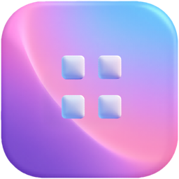

<div align="center">
  
  <h1>DockFlow</h1>
  <p><strong>Native macOS utility for managing multiple Dock presets, organized by your own categories.</strong></p>
  <p>
    
    
    
    
  </p>
</div>

Create completely different Docks for different contexts — a focused setup for writing, a full toolkit for development, a gaming lineup for evenings — and switch between them with one click, a menu bar pick, or a global hotkey.

## Features

- **Multiple presets.** Each preset has its own categories, items, icon, tint, and optional global hotkey.
- **Categorized items.** Group apps, folders, files, web links, and three spacer styles. Rename, reorder, collapse, color.
- **One-click apply.** Writes `persistent-apps` / `persistent-others` through `cfprefsd`, verifies the change, and restarts the Dock.
- **Automatic backups.** Every apply snapshots your current Dock. Restore any of the last 10 backups instantly.
- **Import current Dock.** Build a preset from your live Dock — as a single list, grouped by type, or for manual review.
- **Menu bar quick-apply.** Presets are always one click away from the menu bar, with category previews and `⌘1…⌘9` shortcuts.
- **Global hotkeys.** Assign a system-wide hotkey per preset (Carbon `RegisterEventHotKey`, no Accessibility permission needed).
- **Launch at login.** Keep DockFlow running in the menu bar via `SMAppService`.
- **Import / export JSON.** Share presets or version-control them.
- **Undo/redo, onboarding, validation badges, keyboard-first workflow.**

## Requirements

- macOS 14 Sonoma or later
- Xcode 16 or later (uses file-system synchronized groups)

## Getting started

```bash
git clone https://github.com/sina-parsania/DockFlow.git
cd DockFlow
open DockFlow.xcodeproj
```

In Xcode → **Signing & Capabilities**: pick your team (Developer ID or Personal Team is fine for local use). Keep **App Sandbox OFF**, **Hardened Runtime ON**. Then `⌘R` to run, `⌘U` to test.

### Build a standalone `.app` (no Xcode needed afterwards)

```bash
xcodebuild -project DockFlow.xcodeproj -scheme DockFlow -configuration Release \
  -derivedDataPath /tmp/dockflow-release \
  CODE_SIGN_IDENTITY=- CODE_SIGNING_REQUIRED=NO ENABLE_HARDENED_RUNTIME=NO build

cp -R /tmp/dockflow-release/Build/Products/Release/DockFlow.app ~/Desktop/
xattr -cr ~/Desktop/DockFlow.app
codesign --force --deep --sign - ~/Desktop/DockFlow.app
open ~/Desktop/DockFlow.app
```

The app is ad-hoc signed — works on your own machine; for distribution you'll need Developer ID signing + notarization.

## Why this app is not sandboxed

App Sandbox prevents a process from writing to another app's preferences domain. `cfprefsd` silently refuses cross-domain writes from a sandboxed process, and no App Store entitlement grants access to `com.apple.dock`. **DockFlow must ship outside the Mac App Store** as a Developer ID app with Hardened Runtime enabled. The entitlements file sets `com.apple.security.app-sandbox = NO` by design.

## Architecture

Clean layered architecture with dependencies pointing downward only.

```
App           → DockFlowApp, AppDelegate, AppEnvironment (DI container)
Presentation  → SwiftUI views + @Observable AppState
Domain        → Preset / Category / DockItem models, protocols, use cases
Data          → JSONPresetStore, DockService (CFPreferences), BackupStore
Services      → Icon, Validation, Export, Hotkey, LaunchAtLogin
Utilities     → Logger, FileSystem, Debouncer, HexColor
```

Key decisions:

- **File-based JSON persistence** with schema versioning. Presets are document-like and import/export is first-class, so a structured JSON file at `~/Library/Application Support/DockFlow/presets.json` beats SwiftData/Core Data for this domain.
- **`CFPreferences*` for Dock writes** — not direct plist file manipulation — so `cfprefsd` stays in sync.
- **Pure `DockBuilder`** turns a preset into an ordered pair `(persistent-apps, persistent-others)`, placing a separator tile in each list between consecutive categories that contribute items to that list.

### Dock integration flow

1. `ValidationService` checks every item.
2. `ApplyPresetUseCase` strips missing items if the caller opts in.
3. `DockBuilder.build(preset:)` → `DockLayout` of typed `DockTileRepresentation`.
4. `DockService.apply(...)` snapshots the current Dock via `BackupStore`, writes new values via `CFPreferencesSetValue` → `CFPreferencesAppSynchronize` → `killall Dock`.
5. After a 400 ms settle it re-reads and verifies. On mismatch, falls back to `killall cfprefsd` → rewrite → re-verify.
6. `launchAssociatedApps` (optional) opens any `.app` items that aren't already running.

## Testing

`⌘U` in Xcode, or:

```bash
xcodebuild -project DockFlow.xcodeproj -scheme DockFlow \
  -destination 'platform=macOS' CODE_SIGNING_ALLOWED=NO test
```

45 tests covering:

- **`DockBuilderTests`** — category ordering, separator placement across both halves, spacer-only and empty categories, determinism, tile shape.
- **`DockImporterTests`** — every tile kind (file-tile types 41/1, directory-tile, url-tile, spacer variants), unknown types return nil.
- **`JSONPresetStoreTests`** — round-trip, corrupt file, schema-version rejection, export/import re-ID.
- **`PresetCodableTests`** — all item kinds and custom `ItemTarget` round-trip.
- **`CategoryOrderingTests`** — cross-category moves, reorder, delete with/without reassignment.
- **`ValidationServiceTests`, `ExportServiceTests`, `ImportGroupingTests`, `DuplicatePresetTests`.**

## Folder layout

```
DockFlow/
  App/                Entry, delegate, DI container
  Domain/
    Models/           Preset, Category, DockItem, ItemKind, ItemTarget…
    Protocols/        PresetStoring, DockServicing, IconProviding…
    UseCases/         ApplyPreset, ImportCurrentDock, Duplicate, Move
  Data/
    Dock/             DockService, DockBuilder, DockReader, DockWriter, DockRestarter, DockTile, DockImporter
    Persistence/      JSONPresetStore, BackupStore
  Services/           Icon, Validation, Export, Hotkey, LaunchAtLogin
  Presentation/
    Main/             MainWindow, PresetSidebar, PresetDetail, CategorySection, ItemRow, Inspector, ImportDockSheet
    MenuBar/          MenuBarContent
    Settings/         General, Hotkeys, Advanced
    Onboarding/       OnboardingView
    Components/       Empty states, banners, pickers, badges
  Utilities/          Logger, FileSystem, Debouncer, HexColor
  Resources/          Info.plist, entitlements, Assets.xcassets
DockFlowTests/
  Domain/ Data/ Services/ TestSupport/
```

## Edge cases handled

| Case | Handling |
|---|---|
| Missing app path on apply | Listed pre-apply; skipped by default or cancel. |
| Moved / renamed file | Marked missing; inspector has a **Re-target…** action. |
| Duplicate items | Allowed; Dock uses distinct GUIDs. |
| Empty category | Legal; no tiles, no separator. |
| Deleting non-empty category | Sheet offers "move items to…" or "delete items too". |
| Invalid URL | Rejected at edit time and skipped on apply. |
| Dock apply silent failure | Re-verify + `cfprefsd` restart + retry + banner with restore. |
| Imported tile unresolvable | Imported as `.missing`; user can retarget via inspector. |

## Data locations

- Presets & settings: `~/Library/Application Support/DockFlow/presets.json`
- Dock backups: `~/Library/Application Support/DockFlow/Backups/`

## License

MIT. See [LICENSE](LICENSE).
